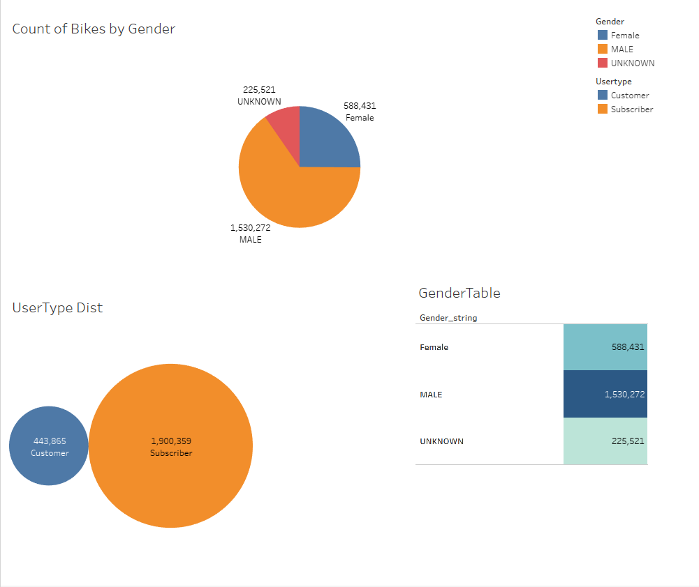
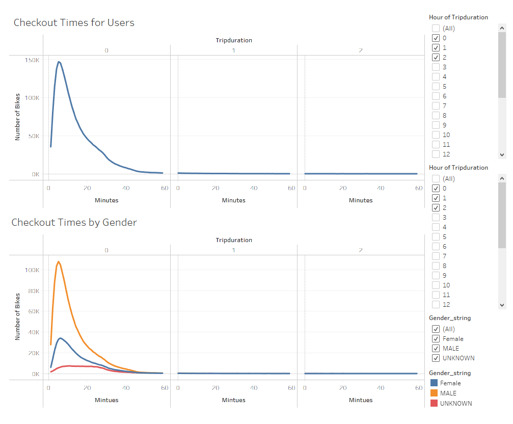
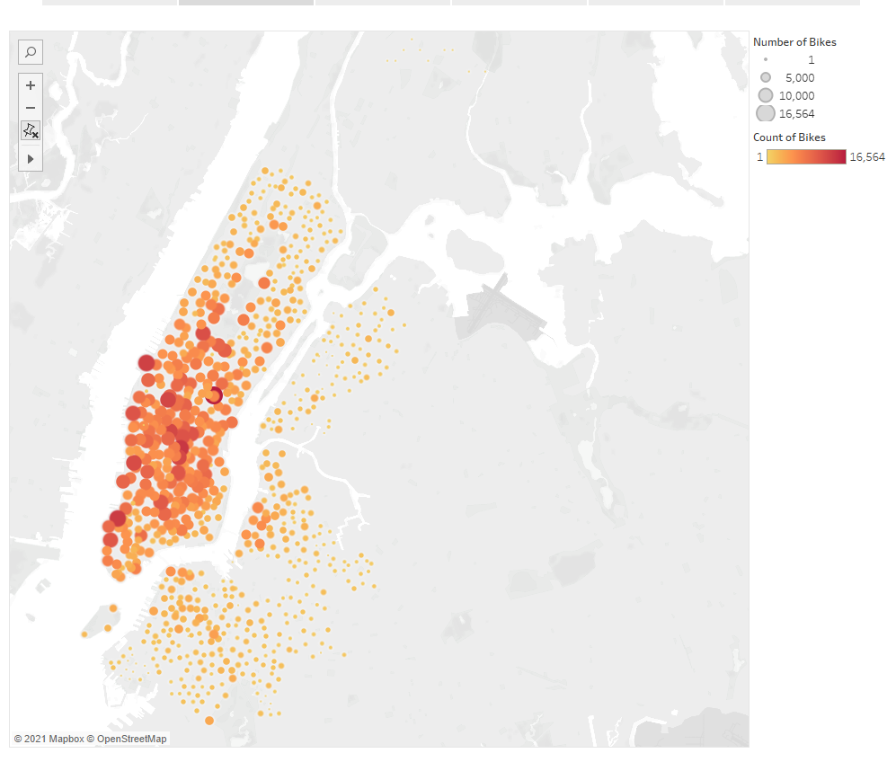
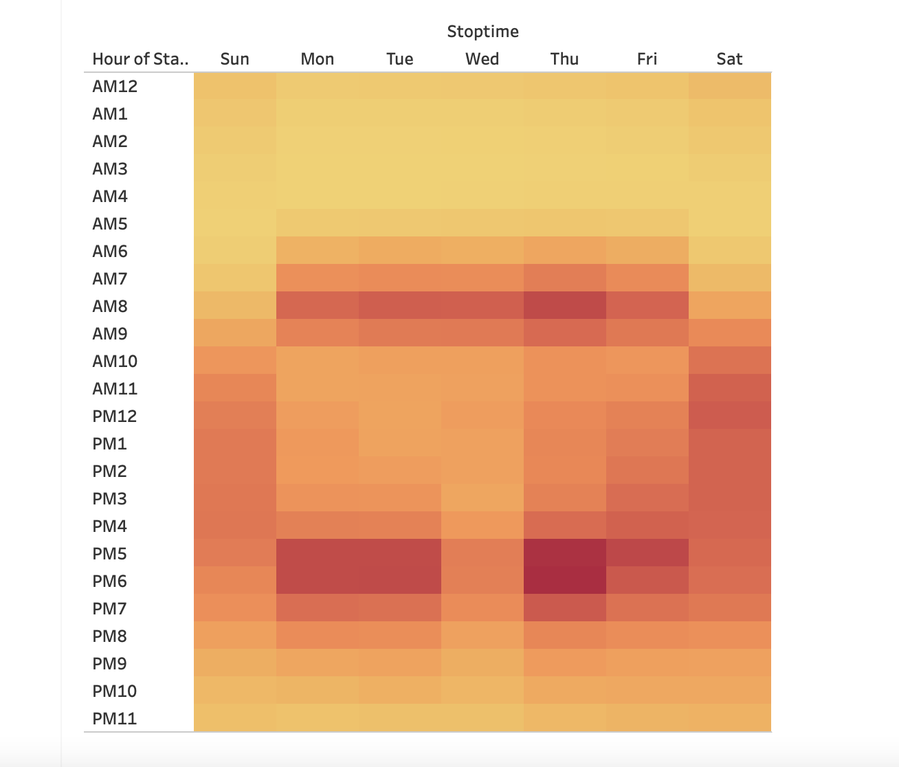
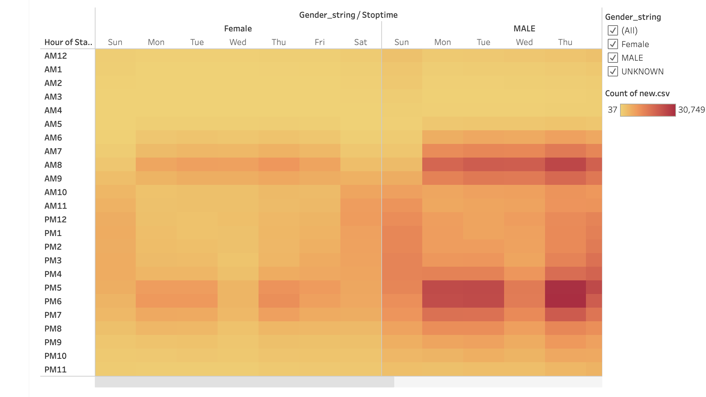
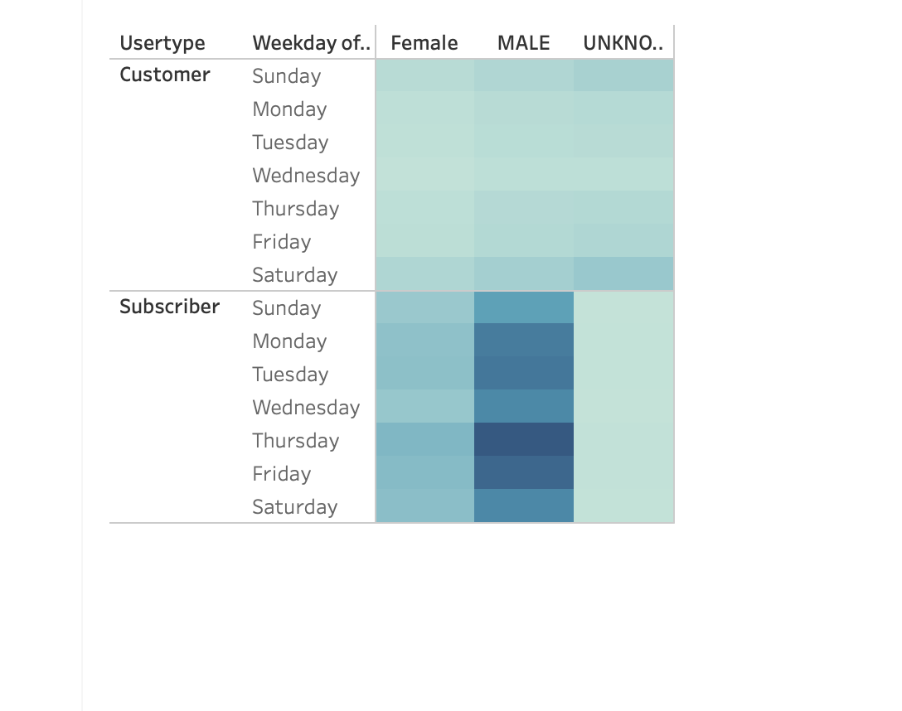

# NYC Citibike

## Overview
For this module, I am using Tableau to do data visualizations in order to present a business proposal for a bike-sharing company which will hold in Des Moines. By filtering the data we get from the bike riding in NY city, we can get the number of riders
in August and so on. By importing, styling, and portraying the data using different plots, we can then determine some drawbacks and advantages of starting a bike sharing company in NY city. Finally, by looking at the data in NY city, we can analyze some key points in start a bike sharing company in Des Moines.

## Results

### Overview Distribution

 - The data shows that there are more males using bikes.
 - people who subcribes the bike riding company use bikes more often compare with people who does not.

### Checkout Times by Genders and all.

 - the checkout time for all users show that people usually checkout a bike after using for 10 minutes
 - the checkout time filtered by gender shows that man likes to ride a bike more.

### Number of bikes show on the heat map
 

  - Manhattan people uses bikes most often.

### Weekday Trips

 - From the plot we can see people would like to ride a bike from 7am to 9am and 4pm to 7pm.

### Weekday trips filtered by Gender

 - The time range for man and woman to use bikes are are the same
 - As concluded above, man uses bikes more often.

###  User Trips filtered by Usertype, by Gender, and by Weekday

 - Subsribers with bike riding company use bikes more often.
 - Males use bikes more often on Thursday.

## Summary
 - Manhattan people use bikes the most
 - Man uses the bikes more often than woman.
 - man use bikes most often on Thursday.
 - people use bikes most often during 7am to 9am and 4pm to 7pm.

Following graphs can be made in order improve:

 - What type of bike people like to ride the most
 - Filter the data with users by age

## Tableau Link
[linkToDashboard](https://public.tableau.com/profile/jingzhi1202#!/vizhome/NYCCitibike_16182438762280/NYCCitibike?publish=yes)
